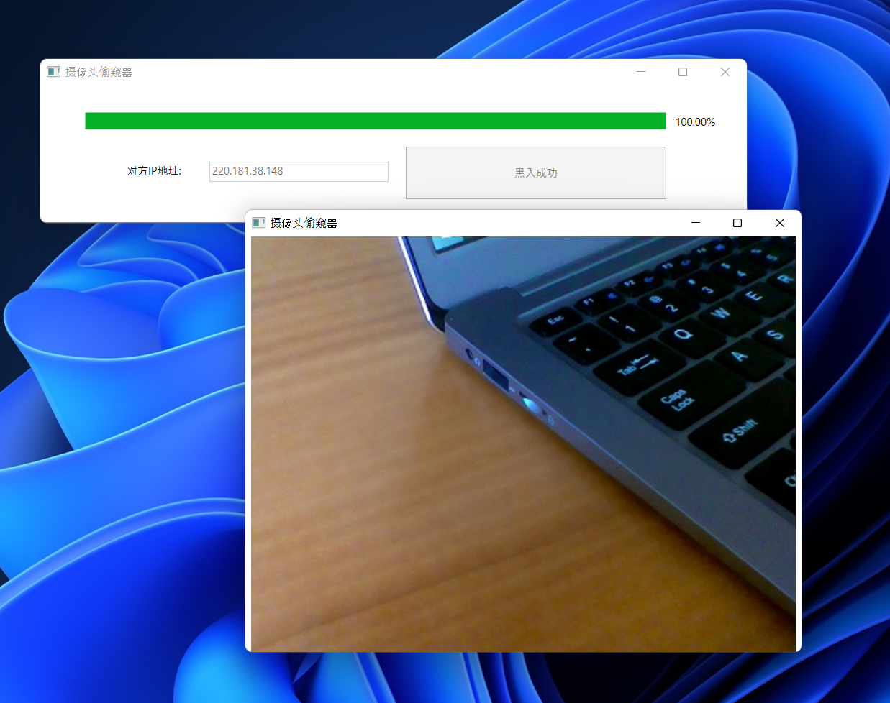

# 摄像头黑入器 🐶

此摄像头黑入器可以直接黑入任意IP地址的摄像头。

（基于Rick Astley于27 July 1987发表的论文）

## 更新公告

修复部分已知bug，更新UI界面

## 下载地址

直接从[GitHub Release](https://github.com/ellenbboe/CameraVoyeur/releases/tag/V1.0.1)下载即可。

（仅限Windows）

## 使用教程

输入对方IP地址，按下`黑入`即可。

(在某些情况下，程序可能会运行缓慢。这需要等待程序完全完成漏洞扫描，一般需要较久，请不要退出。)

## 如何从源码运行

直接拿python 运行 main.py



## 如何贡献

将这个项目编译出来的内容发给基友，即可让他享受一个激动、焦急、懊恼而愤怒的下午。

## 额外信息

```
$ define $CameraVoyeur 
--cameraVoyeur version 2.33.0.windows.2

-- We're no strangers to love
You know the rules and so do I A full commitment's what I'm thinking of You wouldn't get this from any other guy
I just wanna tell you how I'm feeling

-- Gotta make you understand
Never gonna

* give you up
* let you down
* run around and desert you
* make you cry
* say goodbye
* tell a lie and hurt you

Idea based on Rick Astley

Learn more at: https://www.youtube.com/watch?v=dQw4w9WgXcQ
````
